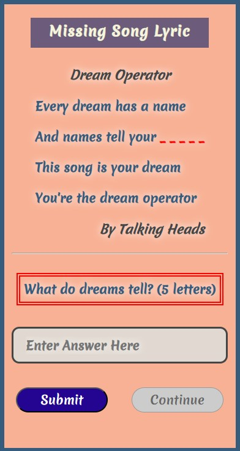
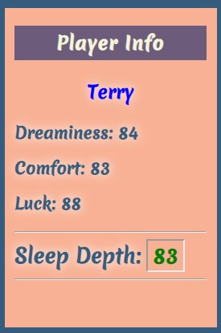
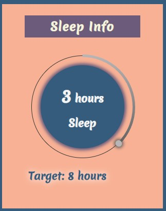
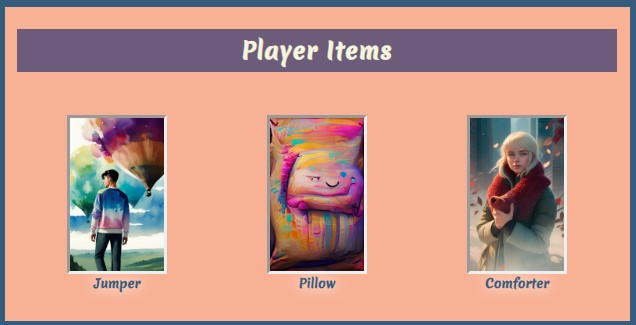

# ChasingDreams
(Developer: Terry Martin)

Based on - jarradbaker readme

[Live webpage](https://terry-martin.github.io/ChasingDreams/)

## Table Of Contents

1. [Project Goals](#project-goals)
    1. [Creator Goals](#creator-goals)
    2. [Player Goals](#player-goals)
2. [Game Info](#game-info)
    1. [Game Themes](#game-themes)
    2. [Game Ideas](#game-ideas)
    3. [Game Basics](#game-basics)
3. [User Experience](#user-experience)
    1. [Target Audience](#target-audience)
    2. [User Requrements and Expectations](#user-requirements-and-expectations)
    3. [User Stories](#user-stories)
4. [Design](#design)
    1. [Design Choices](#design-choices)
    2. [Colour](#colour)
    3. [Fonts](#fonts)
    4. [Structure](#structure)
    5. [Wireframes](#wireframes)
5. [Technologies Used](#technologies-used)
    1. [Languages](#languages)
    2. [Frameworks and Tools](#frameworks-and-tools)
6. [Features](#features)
7. [Testing](#validation)
    1. [HTML Validation](#HTML-validation)
    2. [CSS Validation](#CSS-validation)
    3. [Accessibility](#accessibility)
    4. [Performance](#performance)
    5. [Device testing](#performing-tests-on-various-devices)
    6. [Browser compatibility](#browser-compatability)
    7. [Testing user stories](#testing-user-stories)
8. [Bugs](#Bugs)
9. [Deployment](#deployment)
10. [Credits](#credits)
11. [Acknowledgements](#acknowledgements)

## Project Goals

### Creator Goals
- Build on HTML and CSS learnings
- Include JavaScript for interactivity and feedback
- Create a game about Dreams incorporating the above three languages
- Allow user to read and answer questions about dream songs
- Give user a chance to complete game under certain conditions
- Keep tight control of which buttons are available to user to reduce bugs
- Direct the users focus to what they should do next

### Player Goals
- Input answers to questions
- View current score/stats
- Receive feedback if a question is right or wrong and see overall progress
- Be made aware of target needed to complete game
- Obtain knowlege of game functions through feedback

## Game Info

### Game Themes
- Sleep is the main theme of the game with the goal of achiving eight hours of it. Eight hours is something we are all told is a solid target for us to have healthy lives. However, that eight hours is elusive to most of us because of busy lives or busy brains.
- Dreams are sometimes said to be guardians of sleep. The longer we dream, the longer we sleep.
- Pysical comfort and mental relaxion assist us in having a deeper calmer sleep. Feeling cosy and carefree is another way to put this, so perhaps the idea of ourselves wrapped in our favourite jumper or having a super comfy pillow under our head can help us sleep that tad longer...

### Game Ideas
- Player is given a target of 8 hours sleep to complete them game
- Game itself is a quiz with missing song lyrics
- Each question answered counts as 1 hour of sleep. So, 8 questions to finish the game
- Player is given a Sleep Depth score at start of game. This number will go up or down depending on answers to quiz
- Sleep Depth is also affected by random, external factors (such as neighbours dog is barking)
- Players can find items that increase or decrease their Sleep Depth (such as Dream Jumper)
- If Sleep Depth reaches zero, the player will wake up

### Game Basics
- User will read a short intro and then be invited to click a "Start Dreaming" button
- User will have a view of Missing Song Lyric (Question and Answer Box), Player Info, Sleep Info and Player Items
- Missing Song Lyric will contain 4 lines of a song. One word will be blanked out with red underline in its place
- A question is displayed directly below the song about the missing lyric. The user will be told how many letters are in the missing word
- User will type in text box and will receive feedback if the answer is correct or incorrect.
- Player Info (showing name and player stats), Sleep Info (showing current progress of how many hours currently asleep) and Player Items (any items player made have found. Players can hold a max of 3 items at a time)
- Players have a 1 in 8 chance of getting an item when they answer a question. This means, on avgerage, players will receive one item if they complete the game (8 questions to complete). There are three types of items - Dream Jumper, Luxuiry Pillow and Comforter. Each type also has three versions, so 3 jumers, 3 pillow, 3 comforters. Each item has a different impact on player stats. The items appear in bottom right corner.

## User Experience

### Target Audience
The website is designed with the following target audience in mind:
- Project assessor
- Student peers
- Poeple with an interest in music
- People who enjoy games
- People with a interest in dreams/sleep

### User Requirements and Expectations
- Straight forward, easy to use interface
- Quick page load times
- Feedback for each question they answer
- Feedback on their overall progress
- Clear target to complete the game
- Questions to be interesting with a medium degree of difficulty

### User Stories

#### Player
1. As a player, I want to start the game
2. As a player, I want to understand what the game is about
3. As a player, I want to know how to play the game
4. As a player, I want to be able to see how am i am progressing through the game
5. As a player, I want to verify if i got a an answer right or wrong
6. As a player, I want to be told what the correct answer is if i give the wrong answer
7. As a player, I want to receive acknowledment if i complete the game
8. As a player, I want to be able to play the game without any bugs

#### Creator
13. As the creator, I want showcase my abilities with HTML, CSS and JavaScript
14. As the creator, I want users to enjoy the game and have a interest in completing it
15. As the creator, I want users to be surprised by some of the game features
16. As the creator, I want to think about the songs as they answer the questions and have a desire to play that song afterwards

## Design

### Design Choices
The website was designed with soft colours and whimiscal font to give a relaxed atmosphere. Although the game is based on music questions, luck plays a large part in their ability to complete it. This idea reflects back to the idea that we dont have much control in real life to long we can sleep. 

### Colour
The colour palette was quite small for this website with the colour combination taken from
https://digitalsynopsis.com/design/minimal-web-color-palettes-combination-hex-code/
The colours used were #F8B195 #F67280  #C06C84  #6C5B7B  #355C7D 
Whitesmoke was also used for some of the text.

### Fonts
The font family chosen was 'Merienda One', cursive. This is a flowing, playful script that works well for a game/dream setting

### Structure
The structure of this site is all on one page. There is a main grid of one row and two coloms. This splits the game areas into the left and right part of the screen. The Left side contains the song lyrics, missing word, game question, text box for answer and both control buttons (submit answer and continue). The right had part of main grid shows player info/stats, player progress and player items. A further grid is used in the right hand game section to break it down. FLex is also used extensivily through the site. Sections of the page are hidden or shown when needed. Control buttons are hidden/shown and enabled/disabled when required to reduce user error and also make it more intuitive to the user on what they should do next. An array is used to contain the questions and answers, while a nested array is used to store the different types of items and their sub-items.

### Wireframe 

Most of the game features from the first wire frame made it into submitted version (with a few exceptions, notable NPCs). The overall final layout is similar to original design.

## Technologies Used

### Languages
The following languages were used to develop the website:
- HTML
- CSS
- JavaScript

### Frameworks and Tools
The following frameworks and tools were used to develop the website:
- Github
- Gitpod
- Google
- Google Fonts
- Balsamiq
- Dream by WOMBO

## Features
The website is one page with XXX features

### Question, Answer and Submit for Missing Song Lyric Game

- Displays 4 lines of a song. Each song has Dream theme to it
- It takes 8 songs to complete game. They are selected randomly from a bank of 25 question/answers.
- Questions/Answers are stored in an array. Songs sourced from Google. Questions are custom made
- Text of first question asked flashes on screen to draw user attention and direct their focus
- User is told how many letters there are in missing lyric word
- Answers can be typed in Input Box
- Answers will be accepted in lower and upper case

### Player Info

- Displays users 4 stats with current score - Dreaminess, Comfort, Luck and Sleep Depth
- Dreaminess, Comfort and Luck are generated at the start of each game. Each stat score will start at a number between 70 to 90 (randomly decided)
- These 3 stats are combined to give an overall Sleep Depth score.
- User stats will increase/decrease depnding on answers given to Missing Song Lyric questions

### Sleep Info

- Displays a progress bar (circle) that highlights the numer of hours sleep the user has achived so far
- This increments by one hour each question answered, regardless if the answer given was correct or incorrect
- Each hours sleep costs the user 10 points of each stat
- Target of 8 hours is shown. If user reaches this target they complete the game
- Sleep Depth stat score shows in green when it is high, changes to yellow when in mid range and red when score is low

### Player Items

- This area starts the game blank as user has zero items 
- Items can be found randomly when users answer a question. The chances of finding an item are 1 in 8
- There are 3 types of items - Jumper, Pillow and Comforter
- There are 3 subtypes of each item. Finding any of these items will give a positive or negative influence on user stats. 
- USers can only find one of each item type per game but can possible find 3 items per game (eg, user can find 1 Jumper, 1 Pillow and 1 Comforter per game but not 2 Jumpers)
- Items are displayed as an image after they are found
- These images were generated using Dream by Womba AI imaging, so are custome made

## Validation

### HTML Validation

IMAGE

-

### CSS Validation

IMAGE

-

### JaveScript Validation

IMAGE

-

### Accessibility

The WAVE web accessibility evaluation tool by WebAIM was used to ensure the webpages met accessibility standards. All 5 pages passed without any errors.

### Performance

The Google Lighthouse tool, within the Google Chrome Developer Tools was used to ensure that each page met a high performance rating. This shows that the website will load efficiently over various devices.

Home

### Performance tests on various devices

Throughout development and testing, I used the following devices to ensure that the site was responsive, and worked as intended.

- Laptop running Windows 11
- Samsung S20

### Browser Compatibility

The website was tested on several web browsers to ensure consistency. The browsers used are as follows:

- Microsoft Edge
- Google Chrome
- Firefox

### Testing User Stories

1. As a first time user, I want to understand the product

| **Feature** | **Action** | **Expected Result** | **Actual Result** |
|-------------|------------|---------------------|-------------------|
| Tricks | Navigate to the Tricks page and find any Trick | See the tricks | Works as expected |
| Trick Videos | Navigate to the Tricks page and find any Trick Video | See the trick videos | Works as expected |
| Why Choose Us? | Navigate to the Home page and scoll down | See the Why Choose Us? section | Works as expected |
| Boards | Navigate to the Boards page | See the page containing all the products | Works as expected |
| Products | Navigate to the Boards page, and scroll down | See all of the products available | Works as expected |

Screenshots

  

Tricks

    
  

  

Tricks Videos

    
  

  

Why Choose Us?

    
    
  

  

Boards

    
  

  

Products

    
  

## Bugs

| **Bug** | **Fix** |
|---------|---------|
| Height for most sections wasn't big enough | Removed the max-height value so the height would be as big as the actual content |
| Grid items and Borders not fitting sizing | Added box-sixing: border-box and everything looked as it should |
| Padding issue on tricks page for small mobile phone screens | Removed the padding for smaller screen sizes |
| Social links not directing properly and not opening in a new tab | Corrected all links with http/https, and made them open in new tabs |

## Deployment

The website was deployed through the use of GitHub Pages, a feature built in to GitHub. This can be done by following the steps below.
1. In the desired repository, click on "Settings" from the top menu.
2. From the side menu to your left, select "Pages" in the "Code and automation" section.
3. Make sure the "Source" option is set to "Deploy from a branch"
4. Select the desired "Branch" from the drop down below (main branch in most cases, making sure the director is set to /(root)).
5. Select "Save", and after it refreshes the page, you will see a box at the top of the page providing you with the URL of your now published site.

## Credits

### Media

#### Videos

- "How to Ollie in under 4 minutes" Video was taken from Youtube, from the creator "CCS"
- "How to Shuvit & Pop Shuvit | In-Depth Trick Tip | Tactics" Video was taken from Youtube, from the creator "Tactics Boardshop"
- "HOW TO FS 180" Video was taken from Youtube, from the creator "Jonny Giger"
- "How to Kickflip in 5 minutes" Video was taken from Youtube, from the creator "CCS"
- "How to Heelflip" Video was taken from Youtube, from the creator "Jonny Giger"

#### Images

- "main-hero-image-new.jpg" by "Salvio Bhering" on Pexels
- "404.jpg" by "Erik McLean" on Pexels
- "board1.jpg" from "Vol.1 Checker Skateboard Deck (black and white)" on SkatePro.uk
- "board2.jpg" from "Vol.1 Checker Skateboard Deck (purple and black)" on SkatePro.uk
- "board3.jpg" from "Vol.1 Tie-Dye Skateboard Deck" on SkatePro.uk
- "board4.jpg" from "Blue Baker Signature Deck" on SkatePro.uk
- "board5.jpg" from "Red Baker Signature Deck" on SkatePro.uk
- "board6.jpg" from "Green Baker Signature Deck" on SkatePro.uk

### Code

- HTML: For the interactive google map was taken from google maps.
- HTML: "i" tags with the icons and the social media link icons were all imported from FontAwesome.
- CSS: The font "Quicksand" was imported from Google Fonts.
- HTML: The embedded youtube videos' code was edited to fit my site, but originally from Youtube.

## Acknowledgements

I would like to take this opportunity to acknowledge and thank the following people:
- My mentor Mo Shami for continuous guidance and support.
- My mother, who always encouraged me to strive for a career that I enjoy.
- My peers on the Code Institute Slack channels, for advice and feedback.
- My partener Kirsty, for her belief in me, s